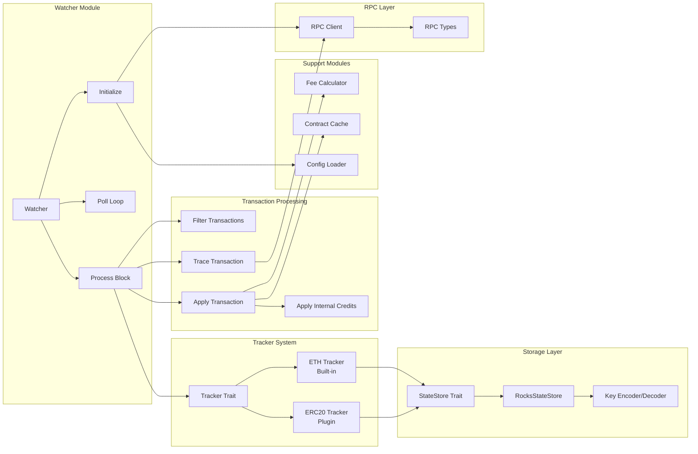

# Component Interaction Diagram

```mermaid
graph LR
    subgraph "Watcher Module"
        W[Watcher]
        INIT[Initialize]
        POLL[Poll Loop]
        PROC[Process Block]
    end
    
    subgraph "Transaction Processing"
        FILTER[Filter Transactions]
        APPLY_TX[Apply Transaction]
        TRACE_TX[Trace Transaction]
        APPLY_INT[Apply Internal Credits]
    end
    
    subgraph "Tracker System"
        TRACKER_TRAIT[Tracker Trait]
        ETH_TRACK[ETH Tracker<br/>Built-in]
        ERC20_TRACK[ERC20 Tracker<br/>Plugin]
    end
    
    subgraph "Support Modules"
        FEE[Fee Calculator]
        CACHE[Contract Cache]
        CONFIG[Config Loader]
    end
    
    subgraph "Storage Layer"
        STORE_TRAIT[StateStore Trait]
        ROCKS_IMPL[RocksStateStore]
        KEYS[Key Encoder/Decoder]
    end
    
    subgraph "RPC Layer"
        RPC[RPC Client]
        TYPES[RPC Types]
    end
    
    W --> INIT
    W --> POLL
    W --> PROC
    INIT --> CONFIG
    INIT --> RPC
    PROC --> FILTER
    PROC --> APPLY_TX
    PROC --> TRACE_TX
    PROC --> TRACKER_TRAIT
    APPLY_TX --> FEE
    APPLY_TX --> CACHE
    APPLY_TX --> APPLY_INT
    TRACE_TX --> RPC
    TRACKER_TRAIT --> ETH_TRACK
    TRACKER_TRAIT --> ERC20_TRACK
    ETH_TRACK --> STORE_TRAIT
    ERC20_TRACK --> STORE_TRAIT
    STORE_TRAIT --> ROCKS_IMPL
    ROCKS_IMPL --> KEYS
    RPC --> TYPES
```
