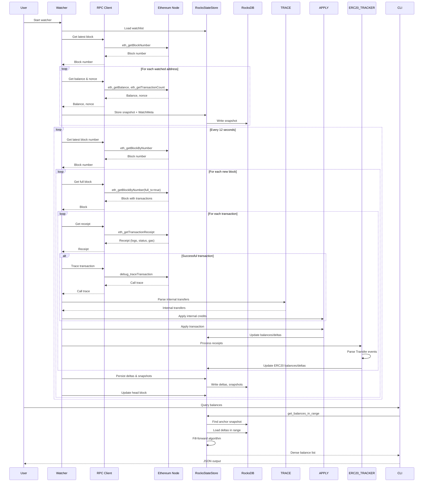

# Data Flow Diagram

```mermaid
sequenceDiagram
    participant User
    participant Watcher
    participant RPC as RPC Client
    participant Node as Ethereum Node
    participant Store as RocksStateStore
    participant DB as RocksDB
    
    User->>Watcher: Start watcher
    Watcher->>Store: Load watchlist
    Watcher->>RPC: Get latest block
    RPC->>Node: eth_getBlockNumber
    Node-->>RPC: Block number
    RPC-->>Watcher: Block number
    
    loop For each watched address
        Watcher->>RPC: Get balance & nonce
        RPC->>Node: eth_getBalance, eth_getTransactionCount
        Node-->>RPC: Balance, nonce
        RPC-->>Watcher: Balance, nonce
        Watcher->>Store: Store snapshot + WatchMeta
        Store->>DB: Write snapshot
    end
    
    loop Every 12 seconds
        Watcher->>RPC: Get latest block number
        RPC->>Node: eth_getBlockByNumber
        Node-->>RPC: Block number
        RPC-->>Watcher: Block number
        
        loop For each new block
            Watcher->>RPC: Get full block
            RPC->>Node: eth_getBlockByNumber(full_tx=true)
            Node-->>RPC: Block with transactions
            RPC-->>Watcher: Block
            
            loop For each transaction
                Watcher->>RPC: Get receipt
                RPC->>Node: eth_getTransactionReceipt
                Node-->>RPC: Receipt (logs, status, gas)
                RPC-->>Watcher: Receipt
                
                alt Successful transaction
                    Watcher->>RPC: Trace transaction
                    RPC->>Node: debug_traceTransaction
                    Node-->>RPC: Call trace
                    RPC-->>Watcher: Call trace
                    Watcher->>TRACE: Parse internal transfers
                    TRACE-->>Watcher: Internal transfers
                    Watcher->>APPLY: Apply internal credits
                end
                
                Watcher->>APPLY: Apply transaction
                APPLY->>Store: Update balances/deltas
                
                Watcher->>ERC20_TRACKER: Process receipts
                ERC20_TRACKER->>ERC20_TRACKER: Parse Transfer events
                ERC20_TRACKER->>Store: Update ERC20 balances/deltas
            end
            
            Watcher->>Store: Persist deltas & snapshots
            Store->>DB: Write deltas, snapshots
            Watcher->>Store: Update head block
        end
    end
    
    User->>CLI: Query balances
    CLI->>Store: get_balances_in_range
    Store->>DB: Find anchor snapshot
    Store->>DB: Load deltas in range
    Store->>Store: Fill-forward algorithm
    Store-->>CLI: Dense balance list
    CLI-->>User: JSON output
```
