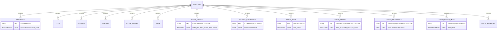

# Database Structure Diagram

```mermaid
erDiagram
    ROCKSDB ||--o{ ACCOUNTS : contains
    ROCKSDB ||--o{ CODE : contains
    ROCKSDB ||--o{ STORAGE : contains
    ROCKSDB ||--o{ HEADERS : contains
    ROCKSDB ||--o{ BLOCK_HASHES : contains
    ROCKSDB ||--o{ META : contains
    ROCKSDB ||--o{ BLOCK_DELTAS : contains
    ROCKSDB ||--o{ BALANCE_SNAPSHOTS : contains
    ROCKSDB ||--o{ WATCH_META : contains
    ROCKSDB ||--o{ ERC20_DELTAS : contains
    ROCKSDB ||--o{ ERC20_SNAPSHOTS : contains
    ROCKSDB ||--o{ ERC20_WATCH_META : contains
    ROCKSDB ||--o{ ERC20_BALANCES : contains
    
    ACCOUNTS {
        string key "A + address(20)"
        AccountRecord value "nonce, balance, code_hash"
    }
    
    BLOCK_DELTAS {
        string key "D + address(20) + block(8)"
        BlockDelta value "delta_plus, delta_minus, fees, nonce"
    }
    
    BALANCE_SNAPSHOTS {
        string key "Z + address(20) + block(8)"
        U256 value "balance after block"
    }
    
    WATCH_META {
        string key "W + address(20)"
        WatchMeta value "start_block"
    }
    
    ERC20_DELTAS {
        string key "T + token(20) + owner(20) + block(8)"
        Erc20Delta value "delta_plus, delta_minus, tx_count"
    }
    
    ERC20_SNAPSHOTS {
        string key "U + token(20) + owner(20) + block(8)"
        U256 value "token balance after block"
    }
    
    ERC20_WATCH_META {
        string key "X + token(20) + owner(20)"
        TokenWatchMeta value "start_block"
    }
```
