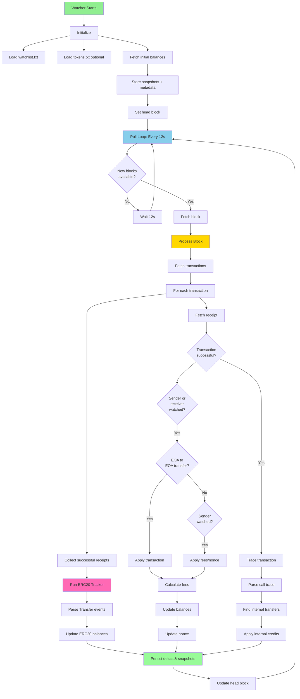

# Processing Pipeline Flow

```mermaid
flowchart TD
    START[Watcher Starts] --> INIT[Initialize]
    INIT --> LOAD_WATCHLIST[Load watchlist.txt]
    INIT --> LOAD_TOKENS[Load tokens.txt optional]
    INIT --> FETCH_INIT[Fetch initial balances]
    FETCH_INIT --> STORE_INIT[Store snapshots + metadata]
    STORE_INIT --> SET_HEAD[Set head block]
    SET_HEAD --> POLL[Poll Loop: Every 12s]
    
    POLL --> CHECK_BLOCKS{New blocks<br/>available?}
    CHECK_BLOCKS -->|No| WAIT[Wait 12s]
    WAIT --> POLL
    CHECK_BLOCKS -->|Yes| FETCH_BLOCK[Fetch block]
    
    FETCH_BLOCK --> PROCESS_BLOCK[Process Block]
    PROCESS_BLOCK --> FETCH_TXS[Fetch transactions]
    
    FETCH_TXS --> FOR_EACH_TX[For each transaction]
    FOR_EACH_TX --> FETCH_RECEIPT[Fetch receipt]
    FETCH_RECEIPT --> CHECK_SUCCESS{Transaction<br/>successful?}
    
    CHECK_SUCCESS -->|Yes| TRACE[Trace transaction]
    TRACE --> PARSE_TRACE[Parse call trace]
    PARSE_TRACE --> FIND_INTERNAL[Find internal transfers]
    FIND_INTERNAL --> APPLY_INTERNAL[Apply internal credits]
    
    CHECK_SUCCESS --> CHECK_WATCHED{Sender or<br/>receiver<br/>watched?}
    CHECK_WATCHED -->|Yes| CHECK_EOA{EOA to<br/>EOA transfer?}
    CHECK_EOA -->|Yes| APPLY_TX[Apply transaction]
    CHECK_EOA -->|No| CHECK_SENDER{Sender<br/>watched?}
    CHECK_SENDER -->|Yes| APPLY_FEES[Apply fees/nonce]
    
    APPLY_TX --> CALC_FEE[Calculate fees]
    CALC_FEE --> UPDATE_BALANCE[Update balances]
    UPDATE_BALANCE --> UPDATE_NONCE[Update nonce]
    
    APPLY_FEES --> CALC_FEE
    
    FOR_EACH_TX --> COLLECT_RECEIPTS[Collect successful receipts]
    COLLECT_RECEIPTS --> ERC20_TRACKER[Run ERC20 Tracker]
    ERC20_TRACKER --> PARSE_LOGS[Parse Transfer events]
    PARSE_LOGS --> UPDATE_ERC20[Update ERC20 balances]
    
    UPDATE_ERC20 --> PERSIST[Persist deltas & snapshots]
    UPDATE_NONCE --> PERSIST
    APPLY_INTERNAL --> PERSIST
    
    PERSIST --> UPDATE_HEAD[Update head block]
    UPDATE_HEAD --> POLL
    
    style START fill:#90EE90
    style POLL fill:#87CEEB
    style PROCESS_BLOCK fill:#FFD700
    style ERC20_TRACKER fill:#FF69B4
    style PERSIST fill:#98FB98
```
