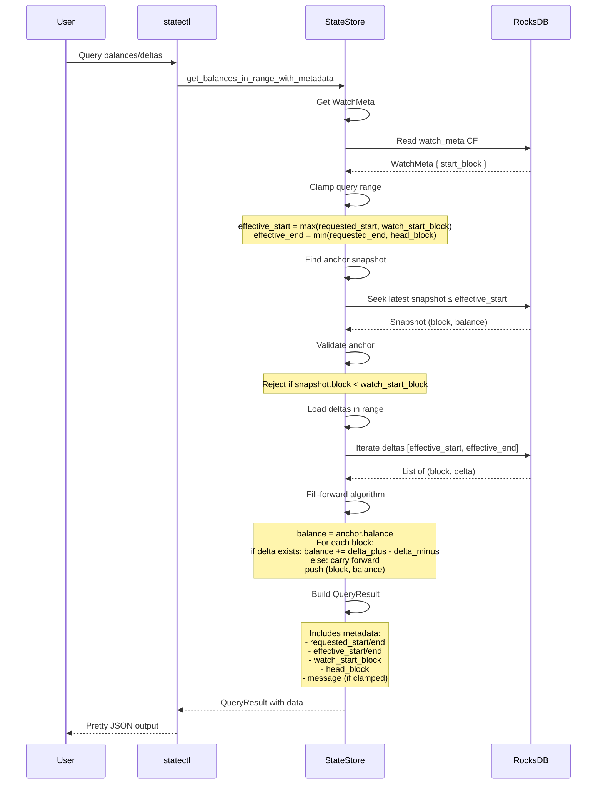

# Query Flow Diagram

```mermaid
sequenceDiagram
    participant User
    participant CLI as statectl
    participant Store as StateStore
    participant DB as RocksDB
    
    User->>CLI: Query balances/deltas
    CLI->>Store: get_balances_in_range_with_metadata
    
    Store->>Store: Get WatchMeta
    Store->>DB: Read watch_meta CF
    DB-->>Store: WatchMeta { start_block }
    
    Store->>Store: Clamp query range
    Note over Store: effective_start = max(requested_start, watch_start_block)<br/>effective_end = min(requested_end, head_block)
    
    Store->>Store: Find anchor snapshot
    Store->>DB: Seek latest snapshot ≤ effective_start
    DB-->>Store: Snapshot (block, balance)
    
    Store->>Store: Validate anchor
    Note over Store: Reject if snapshot.block < watch_start_block
    
    Store->>Store: Load deltas in range
    Store->>DB: Iterate deltas [effective_start, effective_end]
    DB-->>Store: List of (block, delta)
    
    Store->>Store: Fill-forward algorithm
    Note over Store: balance = anchor.balance<br/>For each block:<br/>  if delta exists: balance += delta_plus - delta_minus<br/>  else: carry forward<br/>  push (block, balance)
    
    Store->>Store: Build QueryResult
    Note over Store: Includes metadata:<br/>- requested_start/end<br/>- effective_start/end<br/>- watch_start_block<br/>- head_block<br/>- message (if clamped)
    
    Store-->>CLI: QueryResult with data
    CLI-->>User: Pretty JSON output
```
