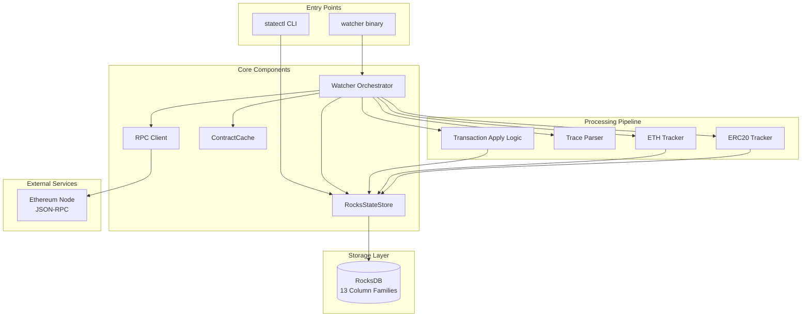

# System Architecture Overview

```mermaid
graph TB
    subgraph "Entry Points"
        CLI[statectl CLI]
        WATCHER[watcher binary]
    end
    
    subgraph "Core Components"
        WATCHER_ORCH[Watcher Orchestrator]
        RPC_CLIENT[RPC Client]
        STORE[RocksStateStore]
        CACHE[ContractCache]
    end
    
    subgraph "Processing Pipeline"
        APPLY[Transaction Apply Logic]
        TRACE[Trace Parser]
        ETH_TRACKER[ETH Tracker]
        ERC20_TRACKER[ERC20 Tracker]
    end
    
    subgraph "External Services"
        ETH_NODE[Ethereum Node<br/>JSON-RPC]
    end
    
    subgraph "Storage Layer"
        ROCKSDB[(RocksDB<br/>13 Column Families)]
    end
    
    CLI --> STORE
    WATCHER --> WATCHER_ORCH
    WATCHER_ORCH --> RPC_CLIENT
    WATCHER_ORCH --> STORE
    WATCHER_ORCH --> CACHE
    WATCHER_ORCH --> APPLY
    WATCHER_ORCH --> TRACE
    WATCHER_ORCH --> ETH_TRACKER
    WATCHER_ORCH --> ERC20_TRACKER
    RPC_CLIENT --> ETH_NODE
    STORE --> ROCKSDB
    APPLY --> STORE
    ETH_TRACKER --> STORE
    ERC20_TRACKER --> STORE
```
